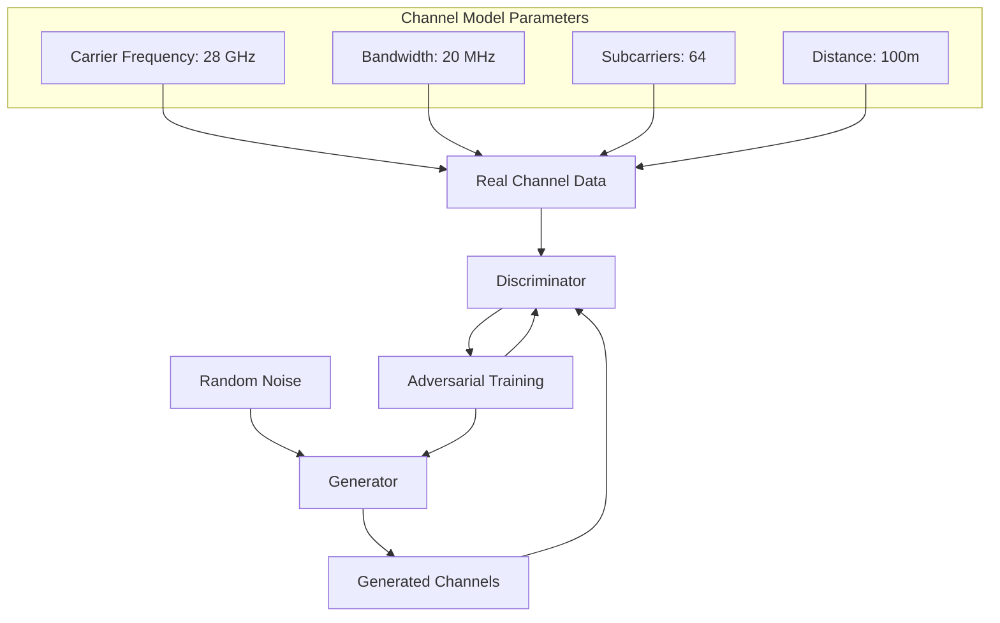

# GAN-based Wireless Channel Modeling for 5G Systems

## Overview
This Proof of Concept implements a Generative Adversarial Network (GAN) to model 28 GHz millimeter-wave (mmWave) channel characteristics for 5G communication systems. The generator learns to produce realistic channel state information (CSI) that captures both path loss and small-scale fading effects.

## Key Features
- Synthetic generation of mmWave channel characteristics
- Rayleigh fading and distance-based path loss simulation
- Modular GAN architecture with configurable parameters
- Training metrics visualization
- 3GPP-inspired channel model implementation

## Implementation Details

### Channel Model
The real channel data simulation combines path loss and Rayleigh fading:
```python
def generate_channel_data(num_samples, num_subcarriers):
    path_loss = 10**(-(128.1 + 37.6*np.log10(100))/10)  # 100m distance
    fading = np.random.rayleigh(scale=0.5, size=(num_samples, num_subcarriers))
    return torch.tensor(path_loss * fading, dtype=torch.float32)
```

### Generator Architecture
```python
class Generator(nn.Module):
    def __init__(self, latent_dim, output_dim):
        super(Generator, self).__init__()
        self.model = nn.Sequential(
            nn.Linear(latent_dim, 128),
            nn.LeakyReLU(0.2),
            nn.Linear(128, 256),
            nn.BatchNorm1d(256),
            nn.LeakyReLU(0.2),
            nn.Linear(256, output_dim),
            nn.Tanh()
        )
```

### Discriminator Architecture
```python
class Discriminator(nn.Module):
    def __init__(self, input_dim):
        super(Discriminator, self).__init__()
        self.model = nn.Sequential(
            nn.Linear(input_dim, 256),
            nn.LeakyReLU(0.2),
            nn.Dropout(0.3),
            nn.Linear(256, 128),
            nn.LeakyReLU(0.2),
            nn.Dropout(0.3),
            nn.Linear(128, 1),
            nn.Sigmoid()
        )
```

## Training Process
The GAN is trained using alternating gradient updates:
```python
def train_gan(generator, discriminator, real_data, epochs=500, batch_size=32, lr=0.0002):
    # Alternating training of discriminator and generator
    # Using BCELoss and Adam optimizers
```

## Usage
1. Install dependencies:
```bash
pip install torch numpy
```

2. Run the channel modeling:
```bash
python gan_channel.py
```

### Example Output
```
Epoch [50/500] | D Loss: 1.2034 | G Loss: 1.0892
Epoch [100/500] | D Loss: 0.8745 | G Loss: 1.4321
...
Epoch [500/500] | D Loss: 0.6931 | G Loss: 0.6932
GAN training completed!
```

## Mathematical Foundation
The GAN objective function:
```
min_G max_D E[log(D(x))] + E[log(1 - D(G(z)))]
```

Channel path loss model (3GPP TR 38.901):
```
PL(d) = 32.4 + 21.0 log10(d) + 20 log10(f) [dB]
Where:
- d: Distance in meters
- f: Frequency in GHz
```

## References
1. [Generative Adversarial Networks](https://arxiv.org/abs/1406.2661)
2. [3GPP Channel Model](https://www.3gpp.org/38-series)
3. [GANs for Wireless Communications](https://arxiv.org/abs/1807.06795)

## System Diagram

